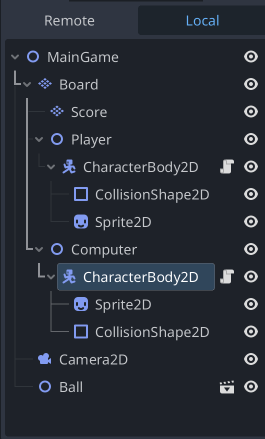

## Ping Pong game with Godot

- [x] Board set with score board area and stripes
- [x] Collision across borders and center line
- [x] Player, Compute default physics
- [x] Ball default physics
- [] Ball movement and bounce off top border
- [] Ball bounce off bottom border
- [] Player/Computer bounce ball
- [] Score reset and Main Menu

<video controls src="debugs.mp4" title="Title"></video>